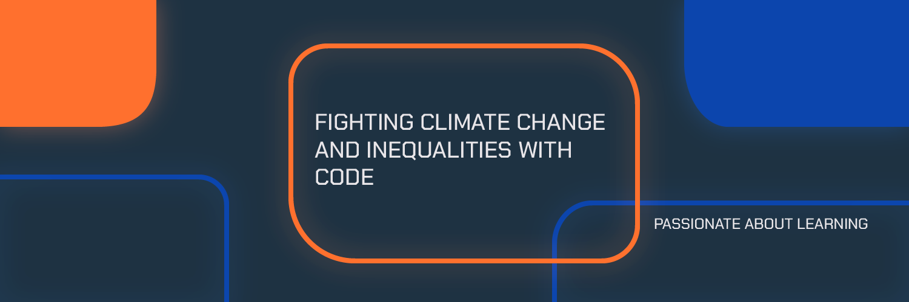

# Hey! I'm Rodrigo Goitia | Rodrux

    

## This is me ✨

I am a Frontend Developer with experience with React.js. I develop user-friendly web applications to achieve effective and disruptive solutions. I want to work for startups that fight climate change and reduce social inequalities.

I am passionate about learning and entrepreneurship. I am an enthusiast of blockchain, web 3.0 and what they'll bring in the future.

Pronuons: He / him

## Technologies 🛠️

### Languages

    
    
    
    
    
    

### Frameworks and Libraries

    
    
    
    
    
    

## My projects 🚀

I enjoy developing personal project in different areas and technologies. You’re welcome to see my best projects:

- <a href="https://github.com/rodruxdev/rodrux-coin-watcher">Rodrux Coin Watcher</a>: See information and price of differente crypto coins with Coingecko API. See the project <a href="http://rodrux-coin-watcher.vercel.app/">here</a>.
- <a href="https://github.com/rodruxdev/buying-list">Buying List</a>: Create your own buying list with this web app. See the project <a href="https://rodruxdev.github.io/buying-list/">here</a>.
- <a href="https://github.com/rodruxdev/trivia-GOTR">GOTR Trivia</a>: A Trivia game of Game Of Thrones and The Lord of The Ring. See the project <a href="https://rodruxdev.github.io/trivia-GOTR/">here</a>.

## Check my stats 📈

    
    

## Find me in the web 💻

- Take a look to <a href="https://www.rodrux.com">my personal web</a>.
- See my experience in <a href="https://www.linkedin.com/in/rodrigo-goitia/">Linkedin</a>.
- See what I talk about in <a href="https://twitter.com/rodruxdev">Twitter</a>.

  

